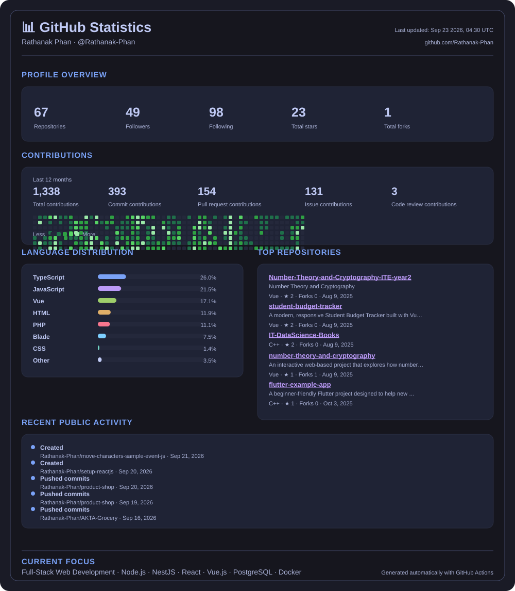

# 
👋 Hello, I'm Rathanak Phan

  

🎓 **IT Engineering Student** | 💻 **
Full-Stack Developer** | 🎯 **Problem Solver**

---

##  About Me
 

  

 

🚀 <a href="https://rathanak-phan.vercel.app/" target="_blank">Visit My Portfolio</a>

I'm a passionate and curious tech enthusiast currently pursuing my **Bachelor's degree in Information Technology Engineering**. I enjoy solving real-world problems with clean, scalable, and efficient code. My goal is to become a skilled full-stack developer who creates meaningful digital experiences that balance functionality with user-centric design.

- 🔭 I'm currently working on **E-Learning Platform** and **Cryptography Visualization**
- 🌱 I'm currently learning **Full-Stack Development** and **Cloud Technologies**
- 👯 I'm looking to collaborate on **Open-source projects** and **Educational platforms**
- 💬 Ask me about **Web Development**, **UI/UX Design**, and **Programming**
- ⚡ Fun fact: I love solving logic puzzles and teaching tech concepts!

---

##  Tech Stack

<!-- 🚀 Technologies and Tools -->

<!--   <h3>🚀 Technologies and Tools</h3> -->

  <kbd>
    

      

         
        <h1 align="start">🧠 Programming Languages</h1>
         
        
        

      

    

  </kbd>

  <kbd>
    

      

         
        <h1 align="start">📦 Frameworks, Libraries & Databases</h1>
         
        
        

      

    

  </kbd>

  <kbd>
    

      

         
        <h1 align="start">☁️ DevOps & Deployment</h1>
         
        
        

      

    

  </kbd>

  <kbd>
    

      

         
        <h1 align="start">💻 Operating Systems & Platforms</h1>
         
        
        

      

    

  </kbd>

  <kbd>
    

      

         
        <h1 align="start">🧰 IDEs & Tools</h1>
         
        
        

      

    

  </kbd>

  <kbd>
    

      

         
        <h1 align="start">🎨 UI/UX & Design</h1>
         
        
        

      

    

  </kbd>

---

## 📊 GitHub Stats

  

---

##  Featured Projects

| Project | Description | Tech Stack | Status | Links |
|---|---|---|---|---|
| **E-Learning Platform** | Full-stack platform for enrollment, quizzes, video lectures, assignments, and progress tracking. | Vue.js, Node.js, Express.js, MySQL, JWT | 🚧 In Development | [GitHub Profile](https://github.com/Rathanak-Phan) |
| **Cryptography Visualizer** | Interactive educational app for learning and visualizing cryptographic algorithms and concepts. | HTML, CSS, JavaScript | 🚧 In Development | [Live](https://ite-year2-cryptography.vercel.app/) |
| **Store Management System** | Console CRUD application for inventory, products, and transactions using file handling. | C++ | ✅ Complete | [Source Code](https://github.com/Rathanak-Phan/cpp-file-crud) |
| **Online Quiz Maker** | Web app for creating, managing, and taking quizzes with authentication and database integration. | Next.js, TypeScript, MongoDB, NextAuth, Tailwind CSS | 🚧 In Development | [GitHub](https://github.com/Rathanak-Phan/online-quizzes-maker) |
| **Student Tracking System** | Student management system for records, attendance, and academic progress. | Laravel, MySQL, React | 📚 Learning / Development | [GitHub Profile](https://github.com/Rathanak-Phan) |

---

##  Currently Learning

I’m currently learning and practicing **Full-Stack Web Development**, building from frontend foundations through backend services, data, authentication, deployment, and testing.

**Learning path:** React / Vue.js → Node.js / Express.js / NestJS → PostgreSQL / MySQL / MongoDB → JWT / OAuth → Docker / GitHub Actions → Jest / API Testing

### ⚙️ Backend
- Node.js
- Express.js
- NestJS
- RESTful APIs

### 🗄️ Database
- PostgreSQL
- MySQL
- MongoDB
- Prisma ORM

### 🔐 Authentication
- JWT
- OAuth 2.0
- Session Authentication

### 🚀 DevOps
- Docker
- GitHub Actions
- CI/CD
- Cloud Deployment

### 🧪 Testing
- Jest
- Unit Testing
- API Testing
- Postman
- Insomnia

### 🎨 Frontend
- React
- Vue.js
- Tailwind CSS

---

##  Connect With Me

  <h3>📄 Profile Info</h3>

  <kbd>
     

         

          
         <strong>📬 Contact Me</strong>
           
         
         
         
         
         

     

  </kbd>

  <kbd>
     

         

           
         <strong>👀 Profile Views</strong>
           
         
         

     

  </kbd>

  <kbd>
     

         

          
         <strong>👥 Followers Count</strong>
            
          
           
         

     

  </kbd>

---

##  Fun Facts & Goals

- 🧩 I love solving **logic puzzles** and **brain teasers**
- 📚 I enjoy **teaching** and explaining tech topics to others
- 🌍 I believe in using **technology** to make education more accessible
- 🚀 Goal: Build impactful applications that solve real-world problems
- 🤝 Open to collaborating on **open-source projects** and **educational platforms**

---

##  Let's Collaborate!

I'm always excited to work on:
- 🌟 **Open-source projects**
- 📚 **Educational platforms**
- 💻 **Full-stack web applications**
- 👥 **Coding communities** and **bootcamp projects**

**🔔 Feel free to reach out if you have any exciting projects or just want to chat about tech!**

---

⭐️ *From [Rathanak Phan](https://github.com/Rathanak-Phan) with ❤️*

